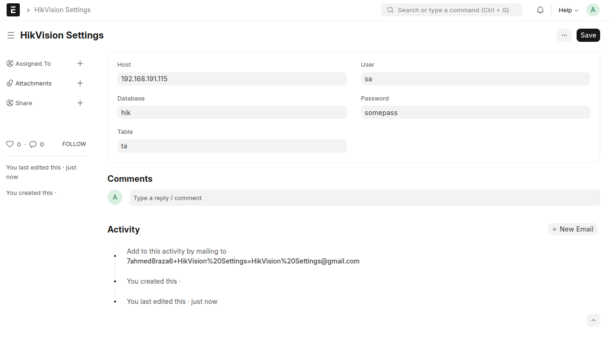
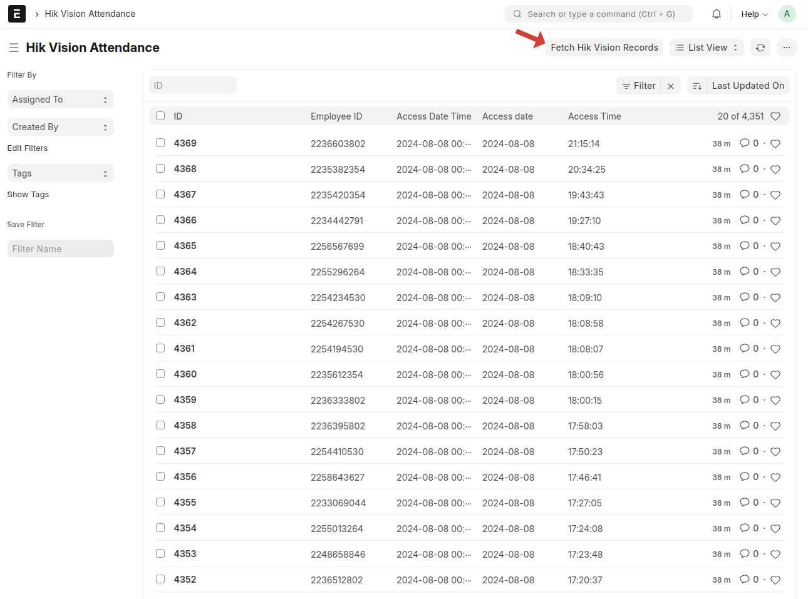

# Integrating MS SQL with ERPNext and Fetching Hik Vision Records

## 1. Add Server to the ZeroTier Network

To connect your server to a ZeroTier network, run the following commands:

`
sudo snap install zerotier
sudo zerotier join 363c67c55aad45d5
2. Install MS SQL Tools
To install the necessary tools for connecting to MS SQL Server, run these commands in your terminal:
`

`
curl https://packages.microsoft.com/keys/microsoft.asc | sudo apt-key add -
sudo add-apt-repository "$(curl https://packages.microsoft.com/config/ubuntu/$(lsb_release -rs)/prod.list)"
sudo apt-get update
sudo apt-get install mssql-tools unixodbc-dev
`

Add MS SQL tools to your PATH:

`
echo 'export PATH="$PATH:/opt/mssql-tools/bin"' >> ~/.bashrc
source ~/.bashrc
`

# Immediately update PATH for the current session

`
export PATH="$PATH:/opt/mssql-tools/bin"
`

Verify the installation:

`
sqlcmd -?
`

3. Connect to MS SQL Server

To connect to your MS SQL Server, use the following command:

`
sqlcmd -S 192.168.191.115 -U sa -P 'Soporte1.$' -Q "SELECT * FROM hik.dbo.ta"
`

4. Install Python Dependency

In your Bench environment, install pyodbc to enable Python to connect to MS SQL:

`
pip install pyodbc
`

5. Configure HikVision Settings in ERPNext

-Login to your ERPNext site.

- - Navigate to HikVision Settings.
- - Configure the following:
- - Host: Your MS SQL Server's IP or hostname.
- - DB User: Database username.
- - DB Password: Database password.
- - Database Name: Name of the database.
- - Database Table: Name of the table containing Hik Vision records.

6. Fetch Hik Vision Records

- Go to the Hik Vision Attendance doctype in ERPNext.
- Click on the button Fetch Hik Vision Records.

Wait for the records to be fetched from MS SQL Server into ERPNext.

`
Note:
This operation might result in a timeout error if the data is large. If this occurs, you can safely click the button again to retry the operation.
`